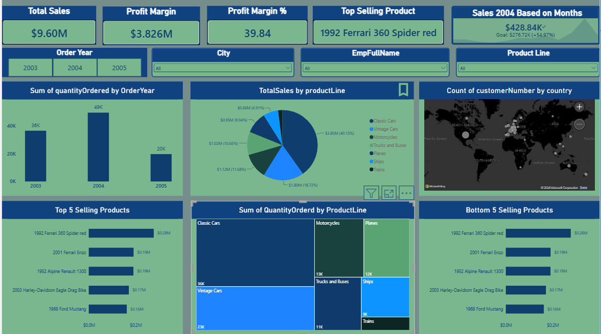
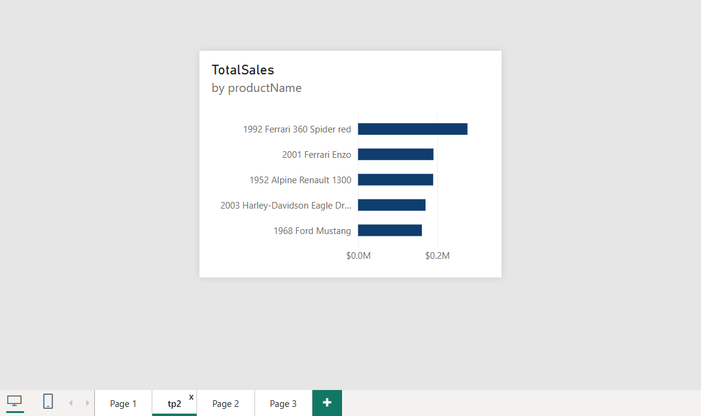
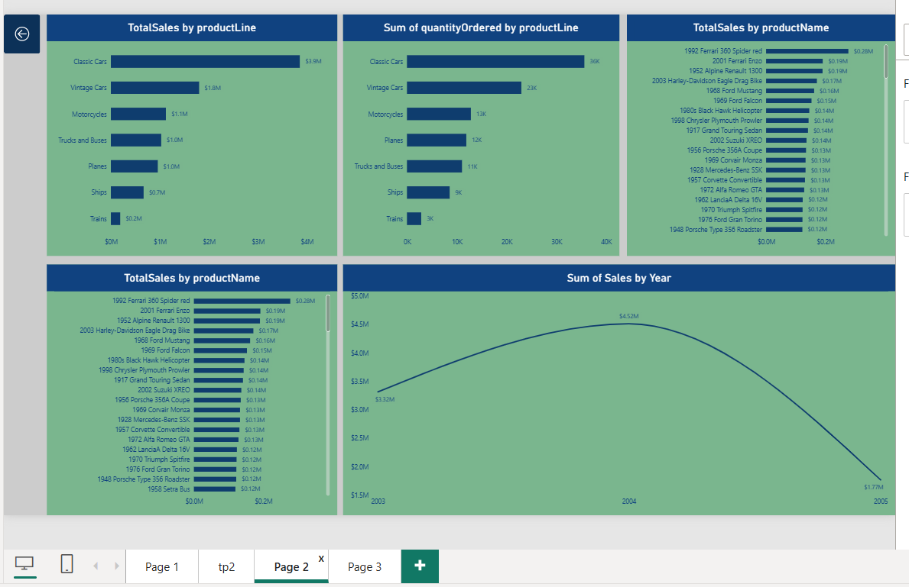
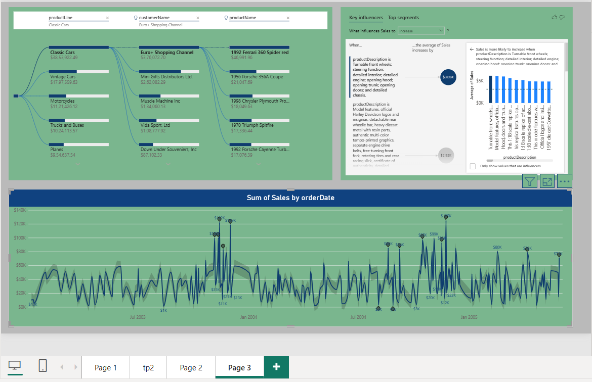

# PowerBI_Sales_Dashboard
Interactive Power BI Sales Dashboard for analyzing sales, profit, products, customers, and business performance.

An interactive Power BI dashboard designed to analyze sales, profit, products, customers, employees, and business performance using data visualization, DAX, and interactive Power BI features.

---

## 📌 Project Overview

This project focuses on transforming sales data into an interactive business intelligence dashboard using Microsoft Power BI.

The dashboard provides an overview of sales and profitability while allowing users to explore business performance across different years, cities, employees, product lines, products, and countries.

It also uses advanced Power BI features such as Key Influencers, Decomposition Tree, Anomaly Detection, bookmarks, buttons, and report-page tooltips.

---

## 🎯 Objectives

- Analyze overall sales and profit performance
- Calculate and monitor profit margin
- Identify the most ordered product
- Compare sales performance across different years
- Analyze product and product-line performance
- Explore sales by country and city
- Provide interactive filtering and navigation
- Identify factors influencing sales
- Detect unusual patterns in sales data

---

## 🛠️ Tools & Technologies

- **Microsoft Power BI**
- **Power Query**
- **DAX**
- **Data Modeling**
- **Interactive Data Visualization**

---

## 📊 Dashboard Features

### 1. Sales & Profit KPIs

The dashboard includes key performance indicators such as:

- Total Sales
- Total Profit
- Profit Margin
- Most Ordered Product
- Total Orders

---

### 2. Interactive Filters

Users can interact with the dashboard using filters such as:

- Order Year
- City
- Sales Representative
- Product Line
- Product

These filters allow users to explore different sections of the data dynamically.

---

### 3. Sales Analysis

The dashboard provides visual analysis of:

- Sales by Product Line
- Sales by Product
- Sales by Country
- Sales by Year
- Monthly Sales Trends
- Quantity Ordered by Product Line

---

### 4. Product Analysis

The dashboard helps identify:

- Top-selling products
- Bottom-selling products
- Most ordered product
- Product-line performance
- Quantity ordered across products

---

### 5. Advanced Power BI Features

The project also demonstrates the use of advanced Power BI capabilities:

- **Key Influencers**
- **Decomposition Tree**
- **Anomaly Detection**
- **Report Page Tooltips**
- **Bookmarks**
- **Navigation Buttons**
- **Interactive Cross-filtering**

---

## 🖼️ Dashboard Preview

### Main Dashboard

---

### Report Page Tooltip

---

### Navigation Buttons & Bookmarks

---

### AI Visuals

---

## 🧮 DAX Measures

The project uses DAX measures for calculations such as:

- Total Sales
- Total Profit
- Profit Margin %
- Most Ordered Product
- Sales in 2003
- Sales in 2004

The complete DAX formulas are available here:

[DAX Measures](DAX/DAX_Measures.md)

---

## 📈 Key Analysis

The dashboard allows users to investigate questions such as:

- What is the total sales and profit?
- What is the current profit margin?
- Which product has the highest quantity ordered?
- How do sales compare across different years?
- Which product lines contribute the most to sales?
- How does sales performance vary by country and city?
- What factors influence sales?
- Are there unusual sales patterns?

---

## 📁 Repository Structure

PowerBI_Sales_Dashboard/
│
├── README.md
│
└── PowerBI_Sales_Dashboard/
    │
    ├── Dashboard/
    │   └── Sales_Dashboard.pbix
    │
    ├── Screenshots/
    │   ├── dashboard.png
    │   ├── tooltip.png
    │   ├── navigation_buttons.png
    │   └── ai_visuals.png
    │
    └── DAX/
        └── DAX_Measures.md

## 💡 Skills Demonstrated

Through this project, I practiced and demonstrated:

Data Analysis
Data Visualization
Data Modeling
DAX
Power Query
KPI Development
Interactive Dashboard Design
Business Intelligence
Data Exploration
Analytical Thinking

## 🚀 Project Outcome

This project demonstrates how Power BI can be used to transform raw sales data into an interactive dashboard for exploring business performance and identifying useful patterns in the data.
